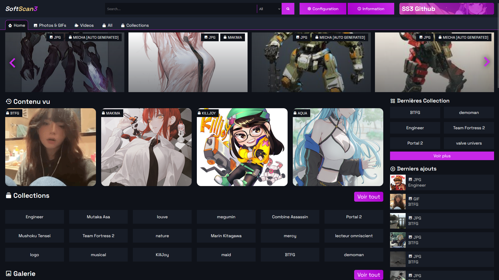
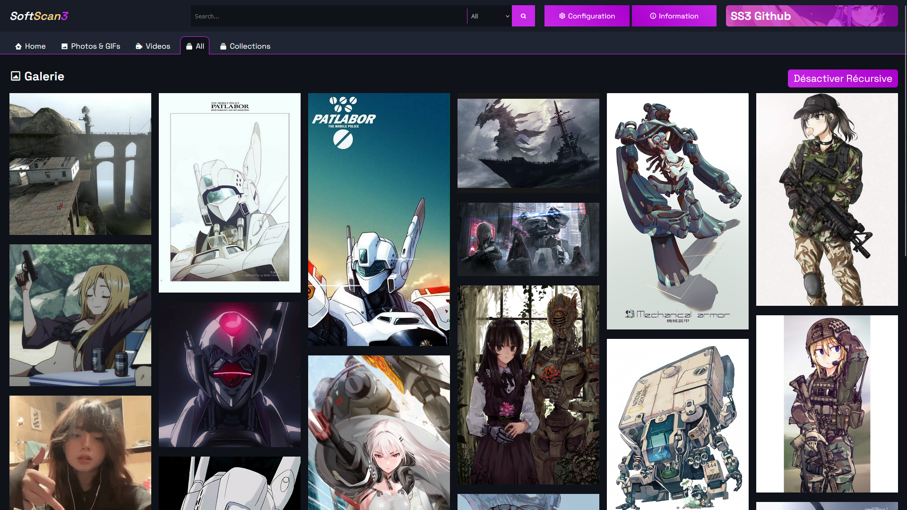
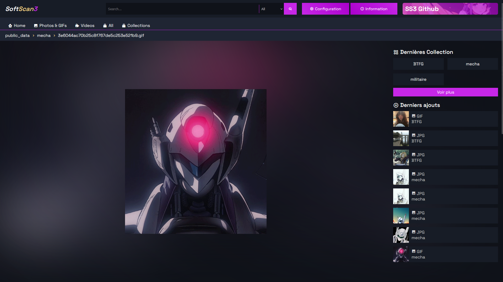
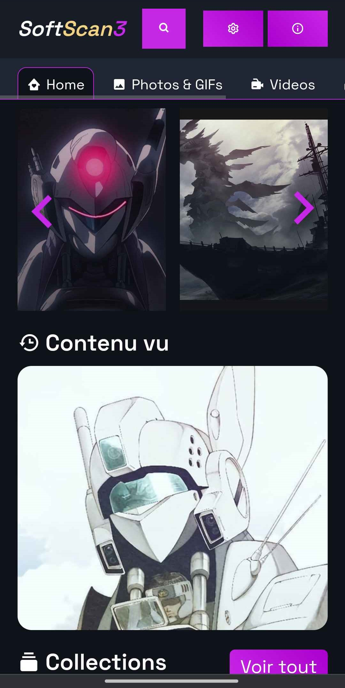
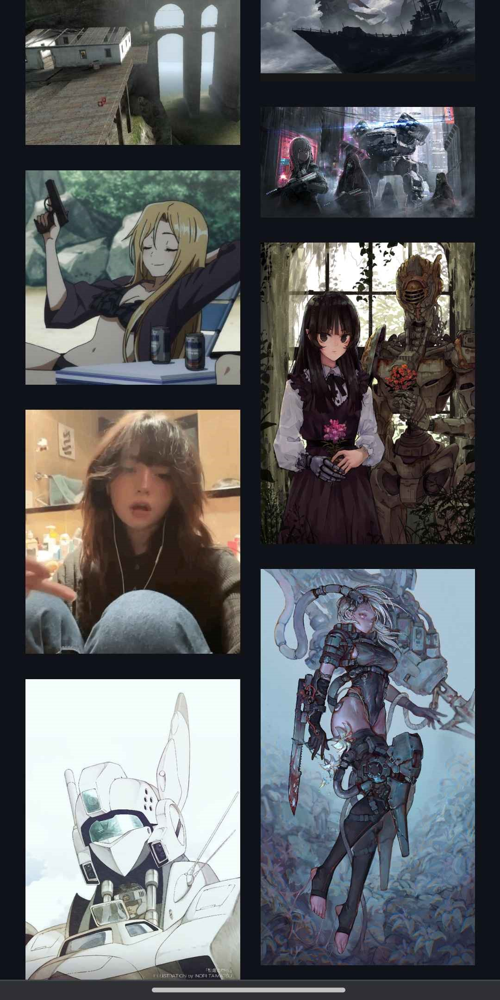

<div align="center">
    
    <h3>SoftScan3</h3>
    <p><em>Version 3 de SoftScan : un scanneur d'images, vidéos et GIFs pour un dossier spécifique. Il permet de gérer facilement une galerie d'images sans configuration nécessaire (ou presque).</em></p>
</div>

<div align="center">
    
</div>

> [!IMPORTANT]
> Ce site a été créé uniquement pour un usage personnel. [En savoir plus](./SECURITY.md) Il n'est ni sécurisé ni optimisé pour un usage publique.

À la base, j'ai réalisé ce site web pour tester mon framework [KerogsPHP-F](https://github.com/KSLaboratories/KerogsPHP-Framework) dans des conditions réelles, et pour améliorer mes connaissances sur les galeries. Voyez-le comme un site bac à sable. Si vous souhaitez y travailler et/ou l'améliorer, libre à vous de faire des PR.

## Fonctionnalités
- Affichage des images dans chaque dossier et sous-dossier.
- Suggestion d'images en rapport avec celle sélectionnée.
- Prise en charge de multiples formats [jpg/jpeg, png, svg, gif, webp, webm, mov, avi, mp4, ...].
- Responsive pour tous les formats d'écran.
- Design épuré et agréable.
- Historique des derniers contenus vus.
- Historique des derniers contenus ajoutés.
- Suivi des dernières collections modifiées.
- Galerie complète pour vidéos.
- Galerie complète pour images/GIFs.
- Galerie complète pour tous les contenus.
- Système de vues, likes, et dislikes.
- Bouton "Surprends-moi".
- Création automatique de miniatures pour les vidéos via FFMPEG.
- Ajout de dossiers complets directement via l'interface (dossiers non compressés).
- Ajout et suppression de dossiers, ainsi que création de nouveaux dossiers directement depuis la page web.
- Option pour réinitialiser les données (nuke) via le site.
- Possibilité de vider les logs depuis l'interface.
- Option pour forcer le chargement FFMPEG à partir du site.
- Possibilité d'éteindre le serveur à distance.
- Recherche avancée fonctionnant avec des URLs de dossiers et différents formats d'extensions.
- Page de connexion sécurisée.

### Aperçu (les images représentes la version ``<=3.1``)
#### Ordinateur
<div align="center">
    
    
    
</div>

#### Téléphone
<div align="center">
    
    
    
</div>

## À savoir
- Les miniatures sont régénérées toutes les 6 minutes (incluant la page d'accueil).
- Le stockage des statistiques se fait dans `public/temp/stats.json`.
- Vous pouvez modifier le mot de passe dans le fichier `public/login.php`.

## Installation
1. Clonez le repository :
```sh
git clone https://github.com/kerogs/softscan3.git
```
2. Hébergez-le sur un serveur local.

3. Installez les packages Composer :
```sh
composer i
```

4. Installez les packages NPM :
```sh
cd public; npm i
```

5. Installez le programme FFMPEG pour générer les miniatures :
    1. Téléchargez l'archive ``.7z`` depuis le site officiel ([cliquer ici](https://www.ffmpeg.org/download.html))

    2. Décompressez l'archive.

    3. Copiez les 3 fichiers suivants dans ``/dist/ffmpeg/bin/``
        - ``chemin/vers/dossier/ffmpeg/bin/ffmpeg.exe``
        - ``chemin/vers/dossier/ffmpeg/bin/ffprobe.exe``
        - ``chemin/vers/dossier/ffmpeg/bin/ffplay.exe``

    4. L'arborescence du dossier ``dist`` devrait ressembler à ceci : :

    ```sh
    📦dist
     ┣ 📂ffmpeg
     ┃ ┗ 📂bin
     ┃ ┃ ┣ 📜.gitkeep
     ┃ ┃ ┣ 📜ffmpeg.exe
     ┃ ┃ ┣ 📜ffplay.exe
     ┃ ┃ ┗ 📜ffprobe.exe
     ┗ 📜last_ffmpeg.ksc
    ```

6. Déposez vos images dans ``/public/public_data/`` ou importez-les directement depuis le site.


## Configuration de php.ini
> [!IMPORTANT]
> Pour autoriser l'envoi de fichiers depuis le site, il est recommandé de modifier le fichier ``php.ini``.
1. Accédez au fichier ``php.ini`` correspondant à votre version de PHP. Par exemple, avec MAMP et PHP 8.3.1 : ``C:\MAMP\conf\php8.3.1\php.ini``.
2. Configurez les valeurs suivantes (exemple adapté pour un usage local) :
```ini
upload_max_filesize = 9999999G
post_max_size = 99999999G
max_file_uploads = 500000
memory_limit = 999999G
max_input_time = 360000
max_execution_time = 360000
``` 
3. Redémarrez votre serveur web.


## Problèmes connus
- Sur téléphone, lors de l'envoi de plusieurs fichiers, une erreur peut survenir et seulement une partie des fichiers sera transférée.
