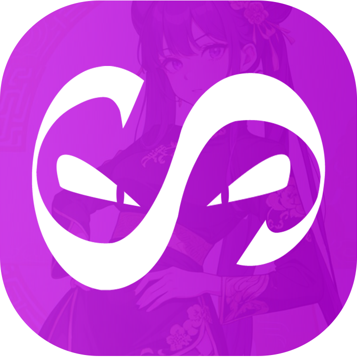

# softscan2

    
    <h3>SoftScan3</h3>
    
<em>v3 de SoftScan, SoftScan est un scanneur d'image, vidéo et gif pour un dossier spécifique. Il permet de gérer facilement une galerie d'images sans configuration nécessaire.</em>

## Features
- afficher les images de chaque dossier et sous-dossier
- proposer des images en rapport avec celle sélectionné
- tous les formats possible
- responsive tout format
- design agréable

### Preview
#### Ordinateur

    
    
    

#### Téléphone

    
    
    

## Installation
1. Installer tout le repository
2. Le mettre sur un serveur local
3. Déposer les images dans /public/public_data ou les importer directement depuis le site

## A ajouter
- [ ] Paramètre
- [ ] Infobox
- [ ] Pouvoir ajouter des images/video/gif en plusieurs fois
- [x] capable de faire un tris dans le contenu
- [ ] possibilité d'éteindre le serveur à distance
- [ ] faire un nuke du site
- [x] faire le design
- [x] faire le responsive
- [ ] faire une page soutien (redirection vers KerogsPHP Framework ou encore l'url du github de SoftScan3)
- [x] Créer une mascotte (future icone du site et pour les boutons ect).
- [x] faire les détourages dela mascotte
- [ ] faire une page login
- [ ] choisir entre un login admin ou membre
- [ ] faire un système de logs du site
- [ ] supprimer des dossiers/sous_dossier
- [x] proposer les différents dossier