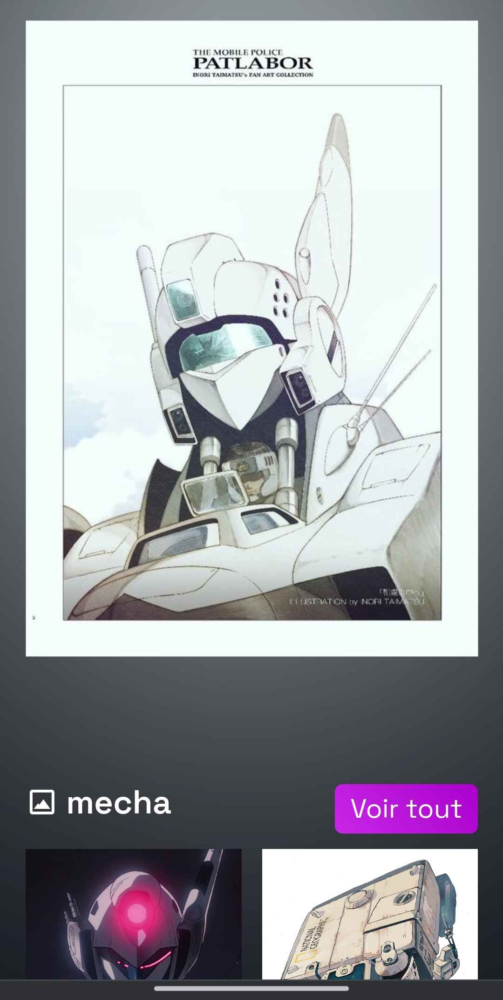

<div align="center">
    
    <h3>SoftScan3</h3>
    <p><em>v3 de SoftScan, SoftScan est un scanneur d'image, vidéo et gif pour un dossier spécifique. Il permet de gérer facilement une galerie d'images sans configuration nécessaire.</em></p>
</div>

<div align="center">

</div>

## Features
- afficher les images de chaque dossier et sous-dossier
- proposer des images en rapport avec celle sélectionné
- tous les formats possible
- responsive tout format
- design agréable
- afficher les derniers contenu vu
- afficher les derniers contenu ajouté
- afficher les dernières collections modifié
- Galerie complète pour vidéo
- Galerie complète pour image/gif
- Galerie complète de tout
- système de vues, like, dislike
- bouton "Surprends moi"

### Preview
#### Ordinateur
<div align="center">
    
    
    
</div>

#### Téléphone
<div align="center">
    
    
    
</div>

## A savoir
- Le renouvellement des thumbnails s'effectue toutes les 6 minutes (+ page d'accueil)
- le stockage des stats se fait dans ``/public/temp/stats.json``

## Installation
1. Installer tout le repository
```sh
git clone https://github.com/kerogs/softscan3.git
```
2. Le mettre sur un serveur local

3. Installer les packages composer
```sh
composer i
```

4. Installer les packages NPM
```sh
cd public; npm i
```

5. Installer le programme **FFMPEG** pour les thumbnails
    1. Installer le ``.7z`` sur le site officiel ([cliquer ici](https://www.ffmpeg.org/download.html))

    2. Décompresser le dossier

    3. Dans le dossier décompresser récupérer les 3 fichiers suivant et les déposer dans ``/dist/ffmpeg/bin/``
        - ``chemin/vers/dossier/ffmpeg/bin/ffmpeg.exe``
        - ``chemin/vers/dossier/ffmpeg/bin/ffprobe.exe``
        - ``chemin/vers/dossier/ffmpeg/bin/ffplay.exe``

    4. Vous avez donc normalement sur le site l'arborescence suivante pour le dossier ``dist`` :

    ```sh
    📦dist
     ┣ 📂ffmpeg
     ┃ ┗ 📂bin
     ┃ ┃ ┣ 📜.gitkeep
     ┃ ┃ ┣ 📜ffmpeg.exe
     ┃ ┃ ┣ 📜ffplay.exe
     ┃ ┃ ┗ 📜ffprobe.exe
     ┗ 📜last_ffmpeg.ksc
    ```

. Déposer les images dans /public/public_data ou les importer directement depuis le site

## A ajouter
- [ ] Paramètre
- [ ] Infobox
- [ ] Pouvoir ajouter des images/video/gif en plusieurs fois
- [x] capable de faire un tris dans le contenu
- [ ] possibilité d'éteindre le serveur à distance
- [ ] faire un nuke du site
- [x] faire le design
- [x] faire le responsive
- [ ] faire une page soutien (redirection vers KerogsPHP Framework ou encore l'url du github de SoftScan3)
- [x] Créer une mascotte (future icone du site et pour les boutons ect).
- [x] faire les détourages dela mascotte
- [ ] faire une page login
- [ ] choisir entre un login admin ou membre
- [ ] faire un système de logs du site
- [ ] supprimer des dossiers/sous_dossier
- [x] proposer les différents dossier